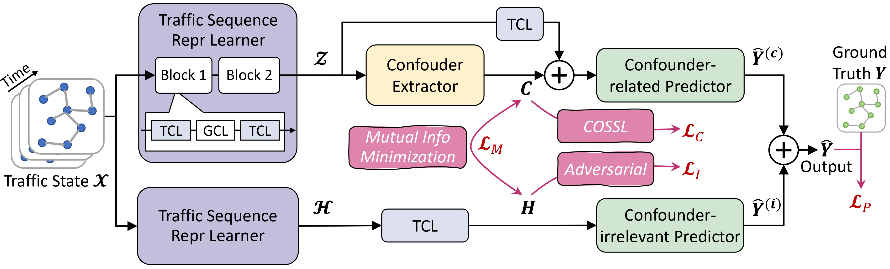

# Seeing the Unseen: Learning Basis Confounder Representations for Robust Traffic Prediction
This is a PyTorch implementation of Seeing the Unseen: Learning Basis Confounder Representations for Robust Traffic Prediction (*STEVE*) for traffic flow prediction as described in our paper: Jiahao Ji*, Wentao Zhang*, Jingyuan Wang, Chao Huang, Seeing the Unseen: Learning Basis Confounder Representations for Robust Traffic Prediction.




## Requirement
We build this project by Python 3.8 with the following packages: 
```
numpy==1.21.2
pandas==1.3.5
PyYAML==6.0
torch==1.10.1
```


## Datasets

The datasets range from `{NYCBike1, NYCBike2, NYCTaxi, BJTaxi}`. You can download them from [Beihang Cloud Drive](xxxurl).

Each dataset is composed of 4 files, namely `train.npz`, `val.npz`, `test.npz`, and `adj_mx.npz`.

```
|----NYCBike1\
|    |----train.npz    # training data
|    |----adj_mx.npz   # predefined graph structure
|    |----test.npz     # test data
|    |----val.npz      # validation data
```

The `train/val/test` data is composed of 4 `numpy.ndarray` objects:

* `X`: input data. It is a 4D tensor of shape `(#samples, #lookback_window, #nodes, #flow_types)`, where `#` denotes the number sign. 
* `Y`: data to be predicted. It is a 4D tensor of shape `(#samples, #predict_horizon, #nodes, #flow_types)`. Note that `X` and `Y` are paired in the sample dimension. For instance, `(X_i, Y_i)` is the `i`-the data sample with `i` indexing the sample dimension.
* `time_label`: a int indicating the time index of latest input data. For example, 9:00 in the morning of workday will be present as 9, while 33 for the weekenday.
* `c`: a intergrate indicating the load level of latest input data.

For all datasets, previous 2-hour flows as well as previous 3-day flows around the predicted time are used to forecast flows for the next time step.
`adj_mx.npz` is the graph adjacency matrix that indicates the spatial relation of every two regions/nodes in the studied area. 

⚠️ Note that all datasets are processed as a sliding window view. Raw data of **NYCBike1** and **BJTaxi** are collected from [STResNet](https://ojs.aaai.org/index.php/AAAI/article/view/10735). Raw data of **NYCBike2** and **NYCTaxi** are collected from [STDN](https://ojs.aaai.org/index.php/AAAI/article/view/4511). If needed, one can download the original datasets from this [link](https://github.com/Echo-Ji/ST-SSL/issues/9).

## run code with:

```
python STEVE/run.py --config_filename configs/NYCBike1.yaml #  configs/NYCBike1.yaml gives the config of pipeline
```

Note that this repo only contains the NYCBike1 data because including all datasets can make this repo heavy.
